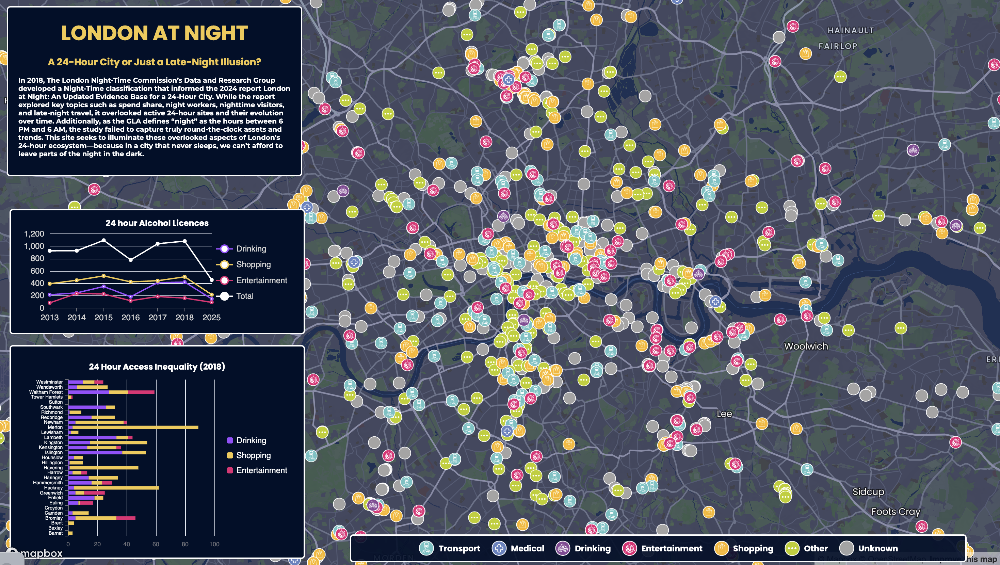

# LONDON AT NIGHT
**A 24-Hour City or Just a Late-Night Illusion?**  

  

---

### Context  
| Category | Details |
|----------|---------|
| **University** | University College London (UCL) |
| **Department** | Centre for Advanced Spatial Analysis (CASA) |
| **Year** | 2024-2025 |
| **Program** | MSc Urban Spatial Science |
| **Module** | [CASA0003 Group Project – Digital Visualisation](https://www.ucl.ac.uk/module-catalogue/modules/group-mini-project-digital-visualisation-CASA0003) |
| **Module Lead** | Duncan Smith |
| **Module Credits** | 30 |
| **Assessment** | Individual Submission |
| **Assessment Weight** | 20% |

---

### 🌃 Project Overview  
This study combines 24-hour alcohol licence data and geolocation data from OpenStreetMap to map London's continuously open establishments. By analyzing spatial and industry variations, it fills a crucial research gap in understanding the city's 24-hour economy.

**Live Application:** [Explore the Study](https://maheer-maps.github.io/London_at_Night/)  

---

### © Creative Commons License  
This work is licensed under [CC BY-NC-ND 4.0](https://creativecommons.org/licenses/by-nc-nd/4.0/).  

For permissions beyond this license, please contact the project authors.
